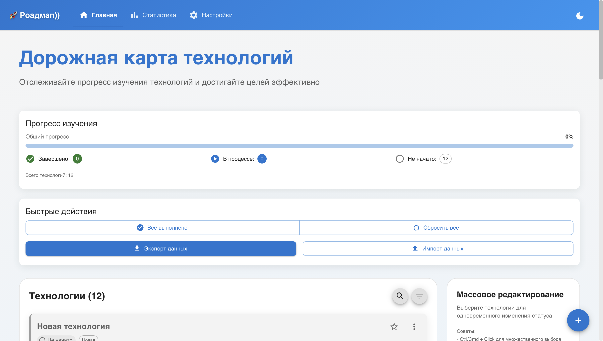
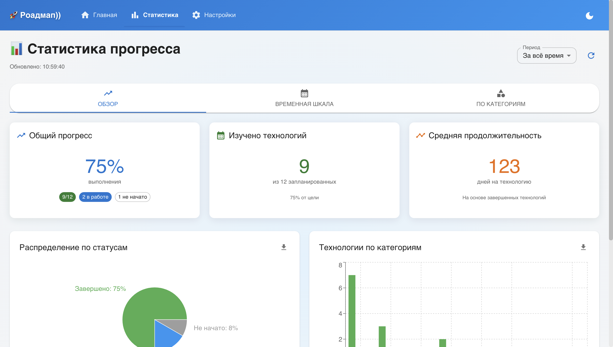

# Для запуска проекта

### Клонировать репозиторий любым удобным способом
### `npm install`
### `npm start`

---------------------------------------------------------

# Приложение для отслеживания прогресса изучения технологий с интуитивным интерфейсом и продвинутыми функциями управления задачами.

# Возможности
 Управление технологиями - создание, редактирование, удаление

- Отслеживание статуса - не начато / в процессе / завершено

- Приоритизация - выделение важных технологий

- Дедлайны - установка сроков изучения

- Теги и категории - организация по темам

# Аналитика
- Визуальная статистика - графики и диаграммы

- Прогресс в реальном времени - автоматическое обновление

- Отслеживание по времени - динамика изучения

- Анализ по категориям - распределение по тегам
- 
